# Детекция и распознавание номерных знаков

## Как запустить и проверить работу

1. Установить зависимости:

```bash
pip install -r requirements_seminar_01.txt
```


2. Открыть ноутбуки из папки [notebooks](notebooks) в таком порядке:

| Ноутбук | Что внутри |
|---|---|
| [01_detection_pipeline.ipynb](notebooks/01_detection_pipeline.ipynb) | подготовка YOLO-разметки, проверка bbox, обучение и test-метрики detector |
| [02_crnn_ocr.ipynb](notebooks/02_crnn_ocr.ipynb) | OCR-датасет, CRNN, CTC-loss, эксперименты, финальная модель |
| [03_end_to_end_demo.ipynb](notebooks/03_end_to_end_demo.ipynb) | полный пайплайн: detector -> crop -> CRNN -> текст номера |

3. Ноутбуки сохранены с output. Для переобучения можно включить флаги `RUN_DETECTION_TRAINING = True` и `RUN_CRNN_TRAINING = True`.

4. Основные сохраненные модели:

| Артефакт | Путь |
|---|---|
| YOLO detector | [outputs/detection/yolo_runs/plate_detector/weights/best.pt](outputs/detection/yolo_runs/plate_detector/weights/best.pt) |
| Финальная CRNN | [outputs/crnn/final_crnn.pt](outputs/crnn/final_crnn.pt) |
| Алфавит OCR | [outputs/crnn/alphabet.json](outputs/crnn/alphabet.json) |

## Часть 1: Подготовка и разметка данных

### 1.1. Сбор данных

Данные для детекции взяты из архива `number_car_detect.zip`:

<https://disk.yandex.ru/d/Rrq4ZoTZnjbCmw>

Локальные файлы:

- исходные изображения: [data/raw/number_car_detect](data/raw/number_car_detect);
- размеченный YOLO-датасет: [data/processed/detection_yolo](data/processed/detection_yolo);
- YOLO config: [data/processed/detection_yolo/dataset.yaml](data/processed/detection_yolo/dataset.yaml);
- метаданные разметки: [data/processed/detection_yolo/metadata.json](data/processed/detection_yolo/metadata.json).

Всего в исходном наборе: `368` изображений.

### 1.2. Разметка для детекции

Разметка сохранена в формате YOLO:

```text
class_id x_center y_center width height
```

Один класс:

```text
license_plate = 0
```

Размечена вся доступная выборка. Bbox сохранены в YOLO-формате. Качество проверялось по QC-визуализациям; для изображения оставлялся один bbox номерного знака.

Итог разметки:

| Показатель | Значение |
|---|---:|
| Всего исходных изображений | `368` |
| Размечено изображений | `368` |
| Доля разметки | `100%` |
| Всего bbox | `337` |
| Кадров без найденного номера | `31` |
| QC-визуализаций | `337` |

Разделение данных:

| Split | Изображений | Bbox | Пустых label |
|---|---:|---:|---:|
| train | `258` | `234` | `24` |
| val | `55` | `51` | `4` |
| test | `55` | `52` | `3` |

Папки с изображениями и label:

- Train images: [data/processed/detection_yolo/images/train](data/processed/detection_yolo/images/train)
- Val images: [data/processed/detection_yolo/images/val](data/processed/detection_yolo/images/val)
- Test images: [data/processed/detection_yolo/images/test](data/processed/detection_yolo/images/test)
- Train labels: [data/processed/detection_yolo/labels/train](data/processed/detection_yolo/labels/train)
- Val labels: [data/processed/detection_yolo/labels/val](data/processed/detection_yolo/labels/val)
- Test labels: [data/processed/detection_yolo/labels/test](data/processed/detection_yolo/labels/test)

Проверка разметки:

- QC-папка: [outputs/detection/label_qc](outputs/detection/label_qc)
- Код проверки: [notebooks/01_detection_pipeline.ipynb](notebooks/01_detection_pipeline.ipynb)

Примеры визуальной проверки:

| Пример | Визуализация |
|---|---|
| `Cars371` | 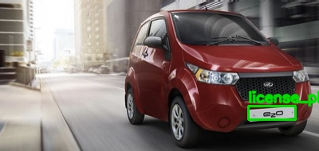 |
| `Cars219` | 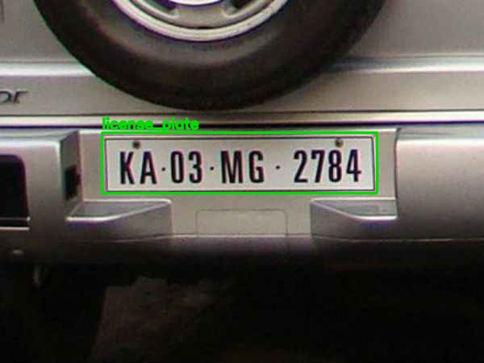 |
| `Cars205` | 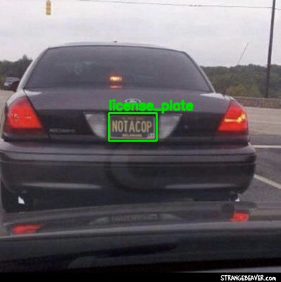 |
| `Cars296` | 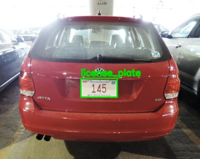 |
| `Cars272` | 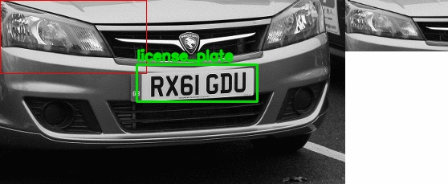 |

## Часть 2: Обучение модели детекции номерных знаков

### 2.1. Базовая модель детекции

Для детекции обучалась YOLO-модель через Ultralytics. Код обучения и оценки находится в ноутбуке:

[notebooks/01_detection_pipeline.ipynb](notebooks/01_detection_pipeline.ipynb)

Параметры обучения:

| Параметр | Значение |
|---|---:|
| epochs | `12` |
| imgsz | `640` |
| batch | `8` |
| device | `cpu` |
| seed | `42` |

Артефакты:

- лучший checkpoint: [outputs/detection/yolo_runs/plate_detector/weights/best.pt](outputs/detection/yolo_runs/plate_detector/weights/best.pt);
- last checkpoint: [outputs/detection/yolo_runs/plate_detector/weights/last.pt](outputs/detection/yolo_runs/plate_detector/weights/last.pt);
- лог обучения: [outputs/detection/yolo_runs/plate_detector/results.csv](outputs/detection/yolo_runs/plate_detector/results.csv);
- test-метрики: [outputs/detection/yolo_runs/plate_detector/test_metrics.json](outputs/detection/yolo_runs/plate_detector/test_metrics.json).

### 2.2. Метрики и анализ

Оценка на `test`:

| Метрика | Значение |
|---|---:|
| Precision | `0.9602` |
| Recall | `0.9423` |
| mAP@0.5 | `0.9884` |
| mAP@0.5:0.95 | `0.8716` |

Краткий анализ:

- сложнее всего изображения с маленьким номером, сильной перспективой, бликами, смазом и нестандартными табличками;
- ошибки чаще появляются там, где номер похож на декоративную табличку, watermark или другой текст рядом с машиной;
- после визуальной проверки были отфильтрованы слишком широкие, слишком узкие и краевые ложные bbox.

Проверка на изображениях из интернета:

- исходные интернет-кадры: [data/external/internet](data/external/internet);
- результаты: [outputs/internet_test](outputs/internet_test);
- источники: [MC Historical Car front license plate](https://commons.wikimedia.org/wiki/File:MC_Historical_Car_front_license_plate.jpg), [MC Historical Car front license plate 1](https://commons.wikimedia.org/wiki/File:MC_Historical_Car_front_license_plate_1.jpg).

| Изображение | Confidence | OCR |
|---|---:|---|
| `mc_historical_car_plate.jpg` | `0.9070` | `A84` |
| `mc_historical_car_plate_1.jpg` | `0.8786` | `A954` |

Примеры интернет-прогона:

| Пример | Результат |
|---|---|
| `mc_historical_car_plate.jpg` | 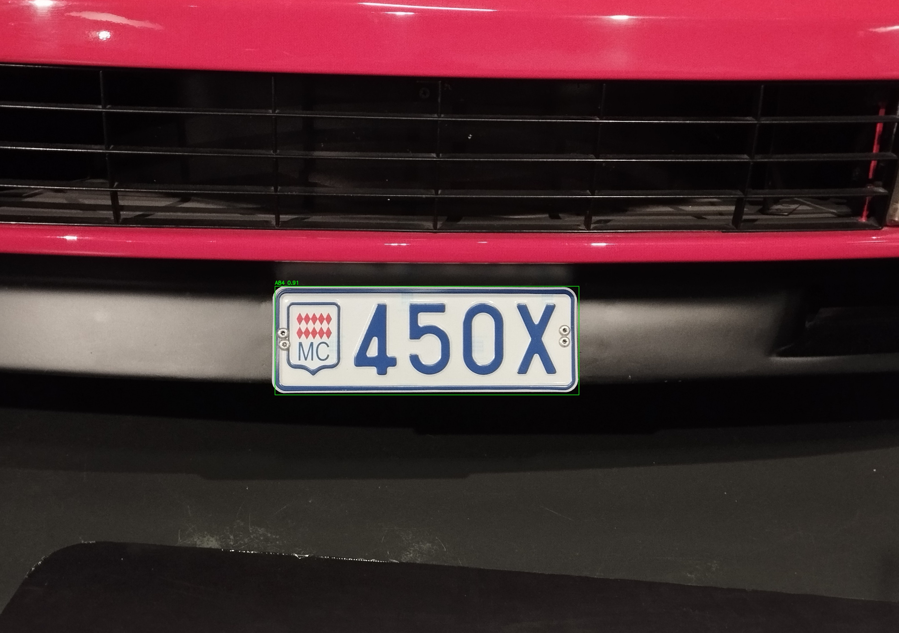 |
| `mc_historical_car_plate_1.jpg` | 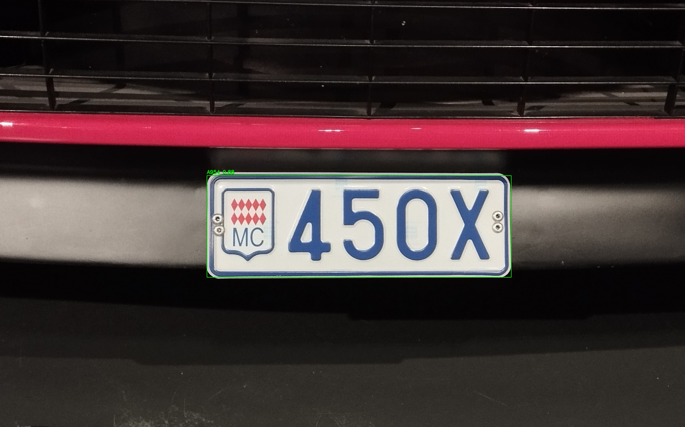 |

На этих изображениях детектор находит область номера, OCR хуже из-за другого формата табличек.

Дополнительная проверка на 8 изображениях, не входивших в train/val/test:

- исходные изображения: [data/external/user_test](data/external/user_test);
- результаты детекции: [outputs/user_test](outputs/user_test);
- JSON с bbox и confidence: [outputs/user_test/predictions.json](outputs/user_test/predictions.json);
- параметры прогона: `imgsz=1280`, `conf=0.05`, `max_det=50`.

Порог confidence снижен, чтобы показать слабые срабатывания на сложных внешних кадрах.

| Изображение | Найдено bbox | Max confidence | OCR верхнего bbox | Комментарий |
|---|---:|---:|---|---|
| `01_russian_close_plate.jpg` | `1` | `0.1780` | `BA6` | низкоуверенный частичный bbox на close-up |
| `02_plate_wall.jpg` | `4` | `0.4862` | `A7096` | найдены отдельные таблички, но коллаж сложен для detector |
| `03_city_traffic_rear.jpg` | `5` | `0.8732` | `OC177AA92` | найдено несколько номеров в городской сцене; центральная Lada идет вторым bbox с confidence `0.8690` и OCR `A777AA777` |
| `04_russian_car_rear.jpg` | `1` | `0.8519` | `CA35` | номер найден уверенно, OCR неполный из-за масштаба crop |
| `05_night_bmw_front.jpg` | `3` | `0.8620` | `A388008PA07` | верхний bbox попал в watermark, фактический номер найден вторым bbox с confidence `0.7997` и OCR `A555BA161` |
| `06_blue_bmw_front.jpg` | `1` | `0.7762` | `E800KY9` | номер найден уверенно, OCR частично ошибается на символах/регионе из-за перекрытия и темного кадра |
| `07_red_lada_front.jpg` | `3` | `0.8979` | `C759MK38` | основной номер найден уверенно, два слабых bbox на краях являются ложными |
| `08_orange_lada_front.jpg` | `1` | `0.8685` | `A0001A832` | номер найден уверенно, OCR частично ошибается на региональном блоке |

Визуализации дополнительного внешнего прогона:

| Пример | Результат |
|---|---|
| `01_russian_close_plate.jpg` | 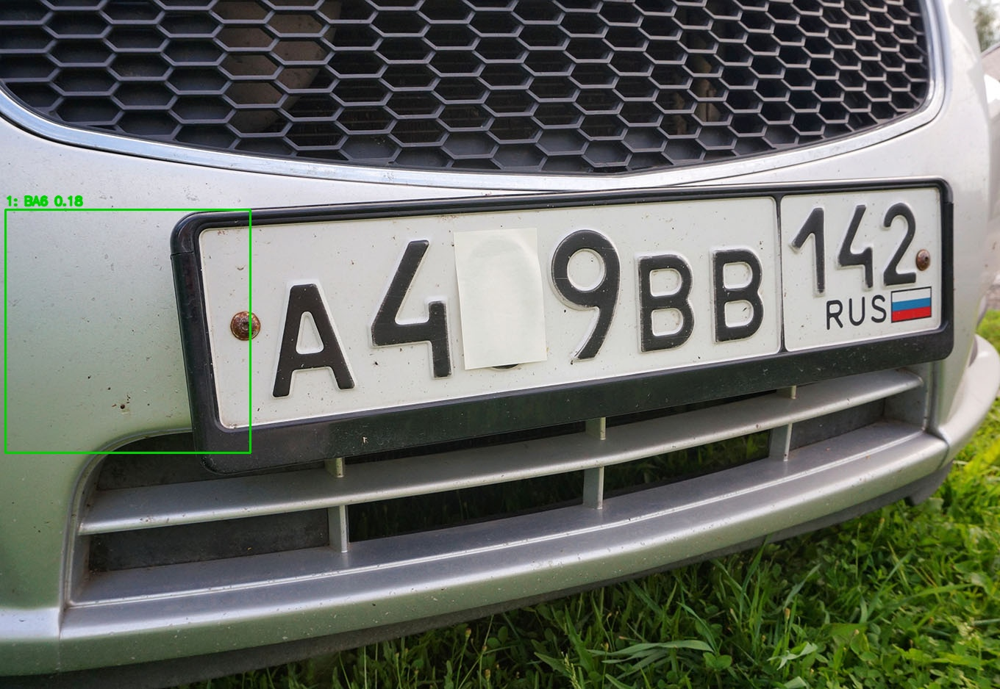 |
| `02_plate_wall.jpg` | 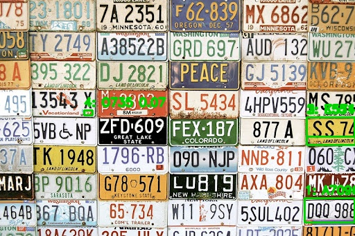 |
| `03_city_traffic_rear.jpg` | 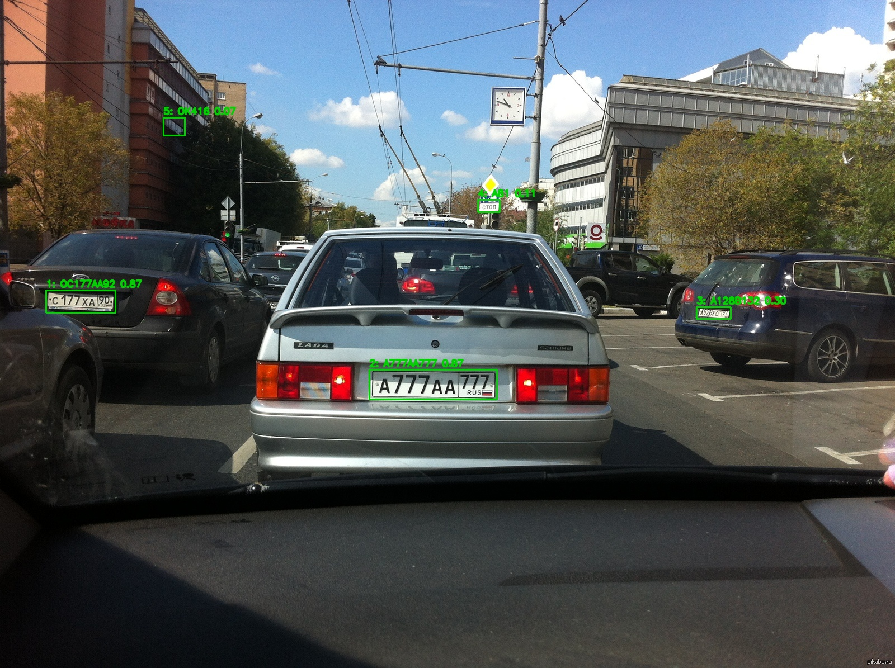 |
| `04_russian_car_rear.jpg` | 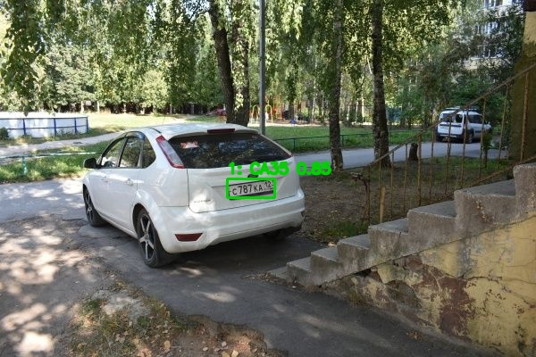 |
| `05_night_bmw_front.jpg` | 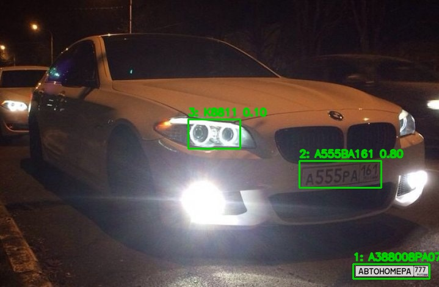 |
| `06_blue_bmw_front.jpg` | 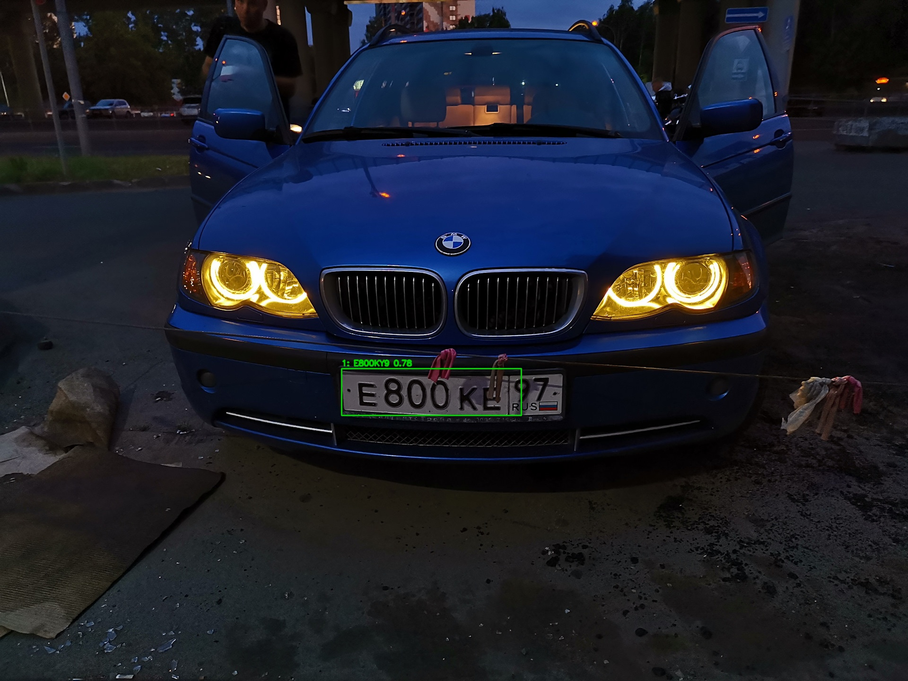 |
| `07_red_lada_front.jpg` | 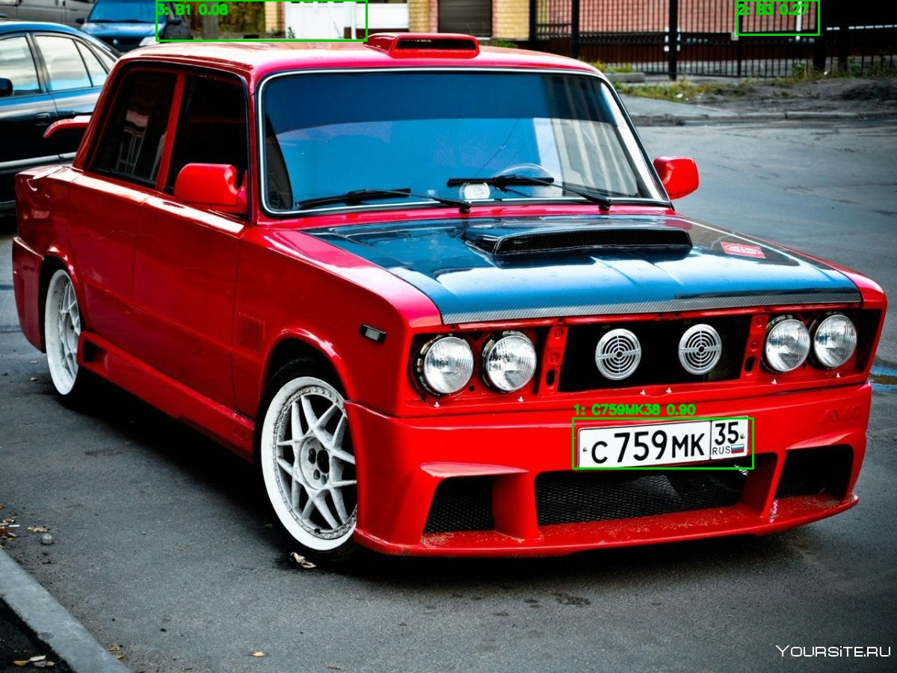 |
| `08_orange_lada_front.jpg` | 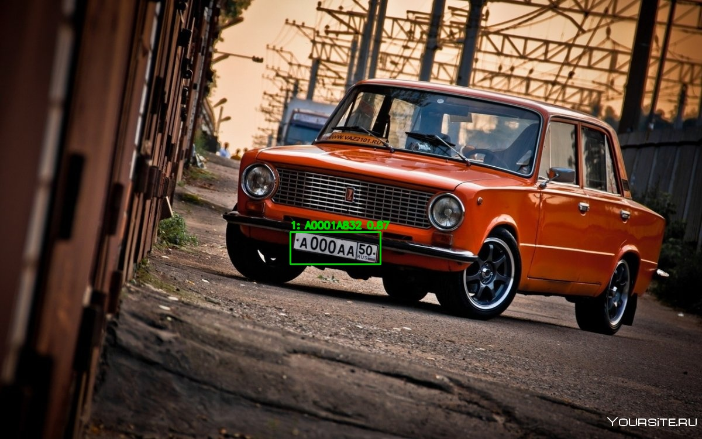 |

## Часть 3: Подготовка данных для распознавания (CRNN)

### 3.1. Получение кропов номерных знаков

Данные для OCR взяты из архива `autoriaNumberplateOcrRu.zip`:

<https://disk.yandex.ru/d/QsuvFDOfp3Ed3w>

Локальные файлы:

- OCR-датасет: [data/raw/autoriaNumberplateOcrRu](data/raw/autoriaNumberplateOcrRu);
- Train annotations: [data/raw/autoriaNumberplateOcrRu/train/ann](data/raw/autoriaNumberplateOcrRu/train/ann);
- Train images: [data/raw/autoriaNumberplateOcrRu/train/img](data/raw/autoriaNumberplateOcrRu/train/img);
- Val annotations: [data/raw/autoriaNumberplateOcrRu/val/ann](data/raw/autoriaNumberplateOcrRu/val/ann);
- Val images: [data/raw/autoriaNumberplateOcrRu/val/img](data/raw/autoriaNumberplateOcrRu/val/img);
- Test annotations: [data/raw/autoriaNumberplateOcrRu/test/ann](data/raw/autoriaNumberplateOcrRu/test/ann);
- Test images: [data/raw/autoriaNumberplateOcrRu/test/img](data/raw/autoriaNumberplateOcrRu/test/img).

В этом датасете уже есть готовые кропы номерных знаков и JSON-аннотации. Текст номера берется из поля `description`.

### 3.2. Формат датасета для CRNN

Формат одного OCR-примера:

- изображение: `split/img/<name>.png`;
- аннотация: `split/ann/<name>.json`;
- ground truth: поле `description`;
- алфавит: `0123456789ABCDEFGHIJKLMNOPQRSTUVWXYZ`.

Алфавит сохранен в файле:

[outputs/crnn/alphabet.json](outputs/crnn/alphabet.json)

Для обучения использовалась подвыборка:

| Split | Количество |
|---|---:|
| train | `8000` |
| val | `1200` |
| test | `1200` |

Код подготовки dataloader и collate-функции находится в ноутбуке:

[notebooks/02_crnn_ocr.ipynb](notebooks/02_crnn_ocr.ipynb)

## Часть 4: Обучение собственной CRNN

### 4.1. Базовый запуск по скрипту семинара

Baseline `CRNN` обучалась по семинарскому подходу: CNN извлекает признаки, BiLSTM формирует последовательность, loss считается через `CTCLoss`.

Базовая конфигурация:

| Параметр | Значение |
|---|---:|
| input size | `32x128` |
| hidden size | `64` |
| LSTM layers | `2` |
| batch size | `64` |
| optimizer | `AdamW` |
| lr | `0.001` |
| epochs | `3` |
| weight decay | `0.0001` |

Baseline result:

| Модель | Test CER | Test exact match |
|---|---:|---:|
| `baseline_32x128` | `0.9242` | `0.0000` |

### 4.2. Эксперименты

Проведены baseline и 3 эксперимента с изменением параметров:

| Эксперимент | Изменение | Input | Hidden | Aug | Scheduler | Test CER | Test exact |
|---|---|---:|---:|---:|---|---:|---:|
| `baseline_32x128` | baseline | `32x128` | `64` | `False` | `none` | `0.9242` | `0.0000` |
| `wide_32x160` | увеличена ширина входа и hidden size | `32x160` | `96` | `False` | `none` | `0.9111` | `0.0000` |
| `augmented_32x128` | геометрические и фотометрические аугментации | `32x128` | `64` | `True` | `none` | `0.8831` | `0.0000` |
| `augmented_cosine_32x160` | шире вход, аугментации, cosine scheduler | `32x160` | `96` | `True` | `cosine` | `0.9694` | `0.0000` |

По validation CER лучшим стал `augmented_32x128`, поэтому он выбран для финального дообучения.

Метрики экспериментов:

[outputs/crnn/experiments_summary.json](outputs/crnn/experiments_summary.json)

### 4.3. Финальная модель CRNN

Финальная модель дообучалась продолжением checkpoint `augmented_32x128`.

Финальная конфигурация:

| Параметр | Значение |
|---|---:|
| input size | `32x128` |
| hidden size | `64` |
| LSTM layers | `2` |
| batch size | `64` |
| optimizer | `AdamW` |
| lr | `0.0005` |
| scheduler | `cosine` |
| epochs финального дообучения | `20` |

Финальные метрики:

| Split | CER | Exact match |
|---|---:|---:|
| val | `0.0032` | `0.9783` |
| test | `0.0054` | `0.9650` |

Сохраненные файлы:

- финальный checkpoint: [outputs/crnn/final_crnn.pt](outputs/crnn/final_crnn.pt);
- лучший checkpoint финального дообучения: [outputs/crnn/final_long/best_crnn.pt](outputs/crnn/final_long/best_crnn.pt);
- финальные метрики: [outputs/crnn/final_metrics.json](outputs/crnn/final_metrics.json);
- алфавит: [outputs/crnn/alphabet.json](outputs/crnn/alphabet.json);
- ноутбук OCR и инференса: [notebooks/02_crnn_ocr.ipynb](notebooks/02_crnn_ocr.ipynb).

Примеры OCR финальной модели:

| GT | PRED |
|---|---|
| `A610AC797` | `A610AC797` |
| `O032OO99` | `O032OO99` |
| `B805HP98` | `B805HP98` |
| `E575HY750` | `E575HY750` |
| `K580XX90` | `K580XX90` |
| `A662EK46` | `A662EK46` |
| `K191OX197` | `K191OX197` |
| `E666PP123` | `E666PP123` |
| `E670AT198` | `E670AT198` |
| `O094CA11` | `O094CA11` |

## Часть 5: Полный пайплайн (детекция + CRNN)

Собран end-to-end процесс:

1. На вход подается изображение автомобиля с номером.
2. Детектор YOLO находит номер на изображении.
3. Найденная область кропается.
4. Кроп передается в `CRNN`.
5. `CRNN` выдает итоговую строку номера.

Код полного пайплайна находится в ноутбуке:

[notebooks/03_end_to_end_demo.ipynb](notebooks/03_end_to_end_demo.ipynb)

Результаты:

- JSON с предсказаниями: [outputs/end_to_end/predictions.json](outputs/end_to_end/predictions.json);
- аннотированные изображения: [outputs/end_to_end](outputs/end_to_end).

Примеры полного пайплайна:

| Изображение | Confidence | OCR |
|---|---:|---|
| `144.jpg` | `0.8885` | `X836P2` |
| `147.jpg` | `0.8978` | `K545OY87` |
| `160.jpg` | `0.7669` | `AP128537` |
| `194.jpg` | `0.8626` | `Y779EM54` |
| `197.jpg` | `0.9306` | `E420EE1235` |
| `227.jpg` | `0.8270` | `C600KA03` |

Визуализации:

| Пример | Результат |
|---|---|
| `147.jpg` | 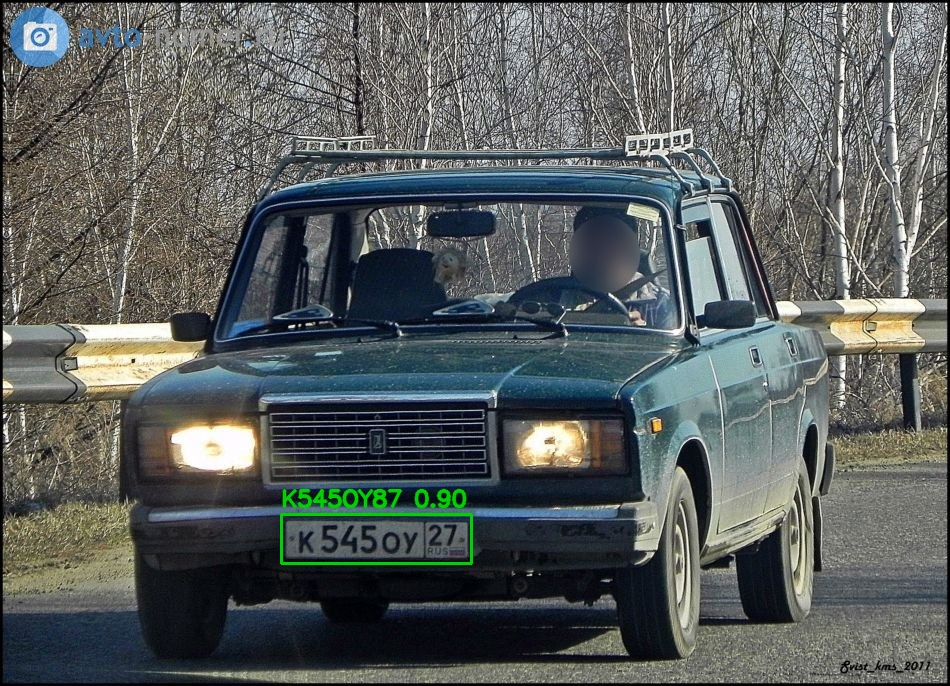 |
| `194.jpg` | 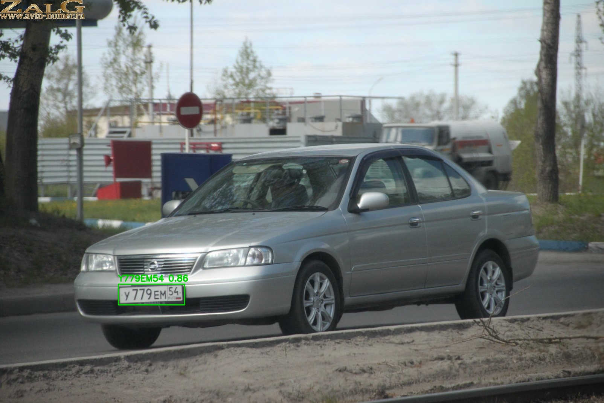 |
| `197.jpg` | 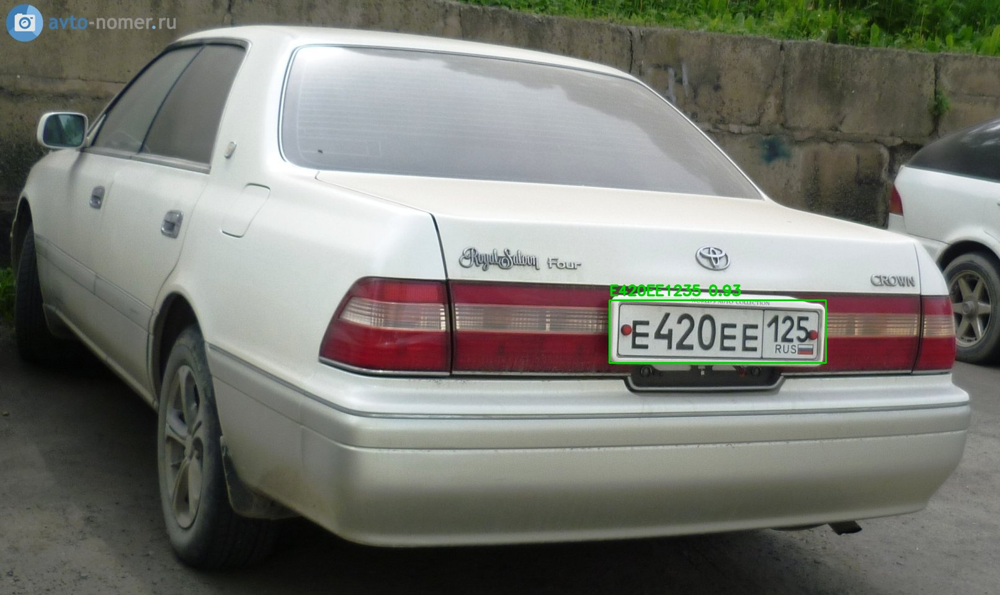 |
| `227.jpg` | 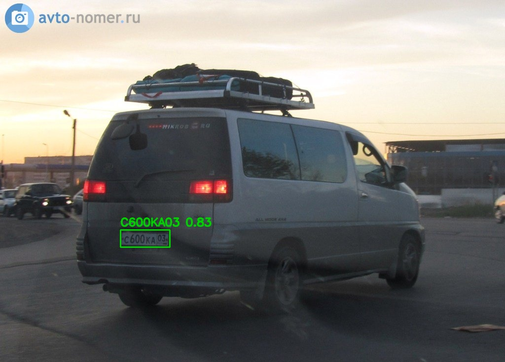 |

Вывод:

- detector стабильно находит область номерного знака: `mAP@0.5 = 0.9884`;
- финальная CRNN хорошо распознает кропы российского формата: `test CER = 0.0054`;
- end-to-end OCR хуже на нестандартных и внешних кадрах: CRNN обучалась на кропах российского формата.
