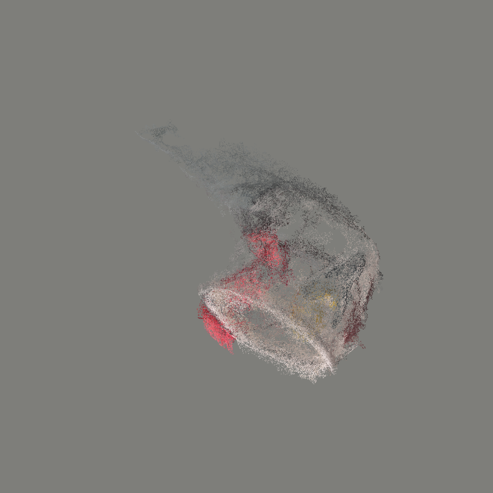
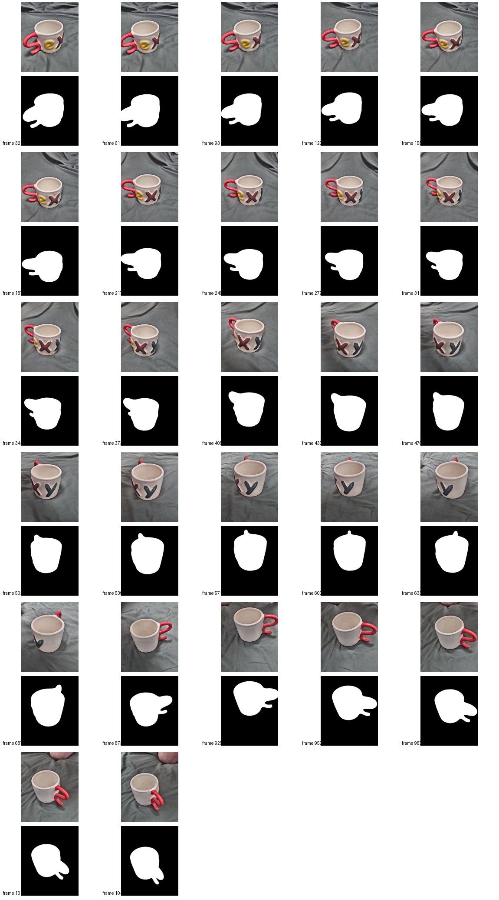
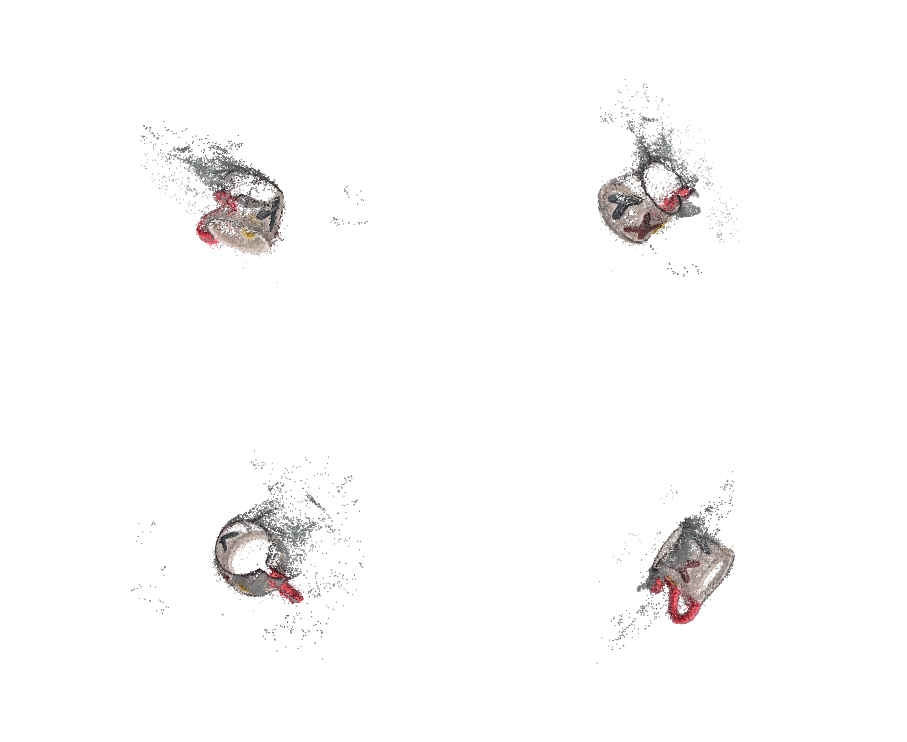
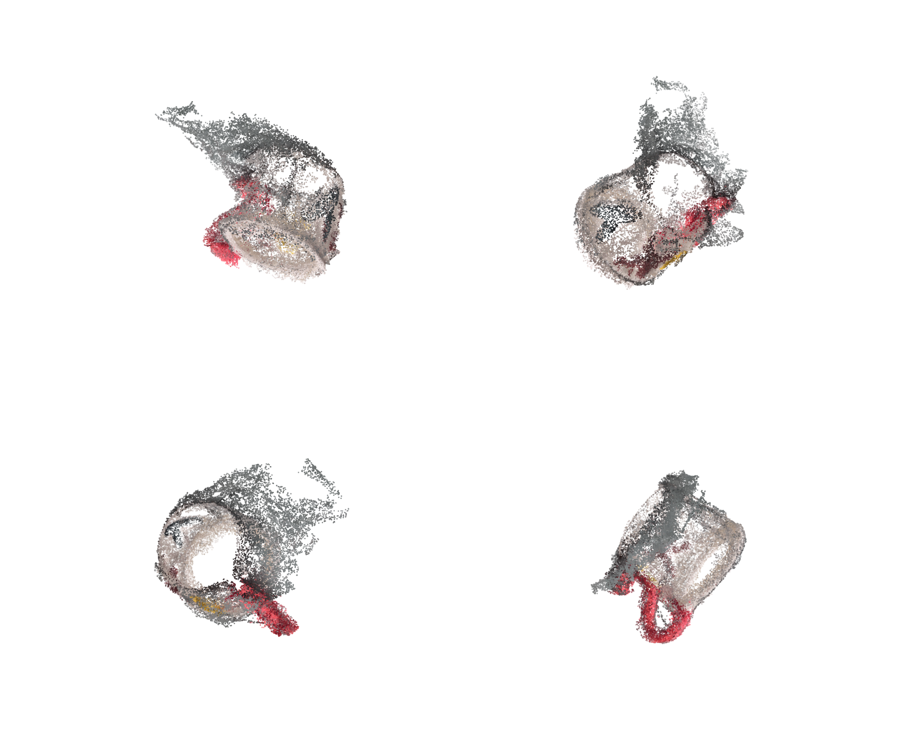
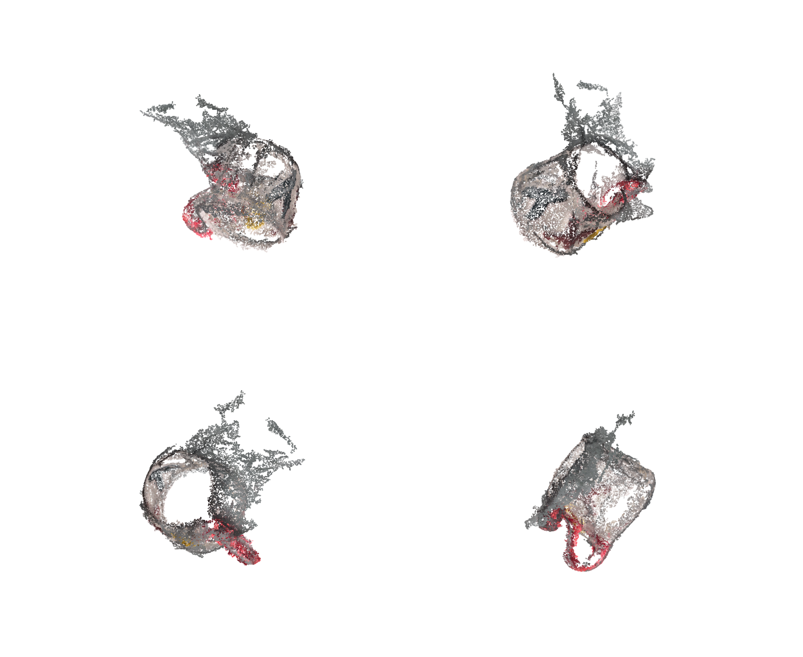
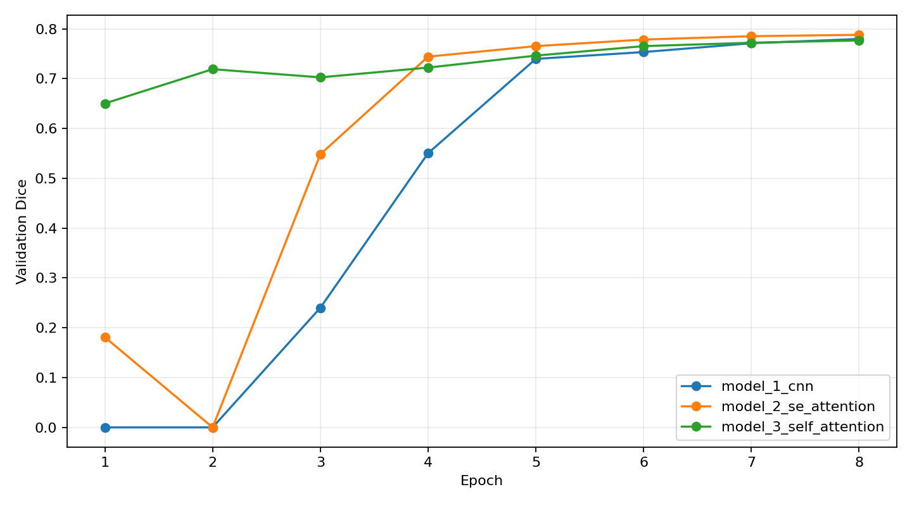
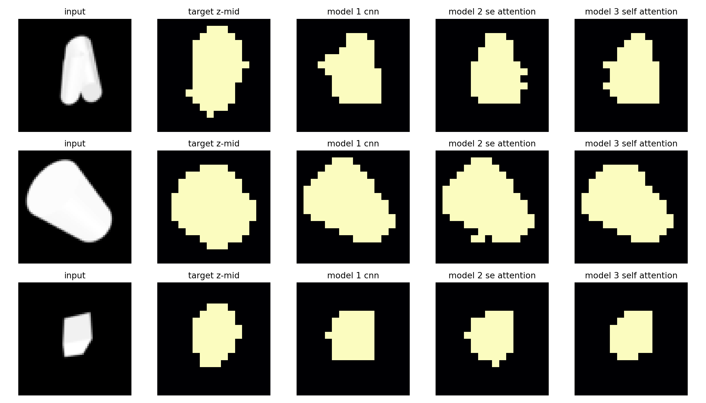

# Seminar 04. Итоговый отчет

В папке собраны финальные файлы работы:

- `source_video_2026-06-01_03-38-58.mp4` - исходное видео объекта.
- `final_model_dense_object_poisson_clean_largest.glb` - итоговая 3D-модель.
- `Video_to_3D_COLMAP_executed.ipynb` - выполненный ноутбук реконструкции по видео.
- `Image_to_Voxel_executed.ipynb` - выполненный ноутбук обучения Image-to-Voxel моделей.

## Video-to-3D reconstruction

Пайплайн: видео -> отбор резких кадров -> маски объекта -> COLMAP sparse SfM -> COLMAP dense MVS -> фильтрация dense-облака по маскам -> построение сетки -> экспорт `GLB`.

Основные результаты:

| Метрика | Значение |
|---|---:|
| Проверено кадров-кандидатов | 420 |
| Использовано кадров | 240 |
| Зарегистрировано изображений COLMAP | 240 |
| Sparse-точек COLMAP | 23 372 |
| Sparse-точек объекта | 8 645 |
| Dense-точек COLMAP | 2 473 408 |
| Dense-точек объекта | 1 246 059 |
| Вершин в итоговой Poisson-модели | 876 735 |
| Граней в итоговой Poisson-модели | 1 749 097 |

Итоговый вид модели:

Кадры и маски, использованные для реконструкции:

Dense-облако объекта:

Превью итоговой Poisson-сетки:

Альтернативная BPA-сетка была дополнительно построена как более открытая модель поверхности:

## Image-to-Voxel

В ноутбуке подготовлены пары `PNG + STL`, реализованы attention-блоки и обучены три модели для восстановления voxel-grid по одному изображению.

| Модель | Val Dice | Val IoU | Test Dice | Test IoU | Voxel accuracy |
|---|---:|---:|---:|---:|---:|
| `model_1_cnn` | 0.7801 | 0.6607 | 0.7984 | 0.6812 | 0.9098 |
| `model_2_se_attention` | 0.7889 | 0.6742 | 0.8071 | 0.6938 | 0.9112 |
| `model_3_self_attention` | 0.7780 | 0.6594 | 0.7964 | 0.6818 | 0.9052 |

Лучшая модель по test Dice: `model_2_se_attention`, `Test Dice = 0.8071`, `Test IoU = 0.6938`.

Графики обучения:

Примеры предсказаний:

